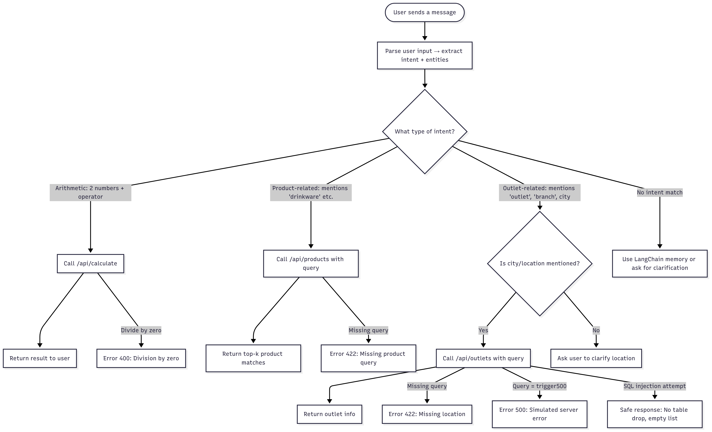

# Mindhive AI Chatbot Engineer Assessment

This project is a complete implementation of the Mindhive AI Chatbot Engineer Technical Assessment. It includes a multi-turn conversational agent with memory, agentic planning, tool usage, custom API integration (RAG/Text2SQL), and robust error handling for unhappy flows.

---

## ✅ Setup & Run Instructions

### 1. Clone the Repository

```bash
git clone https://github.com/zayedrmdn/Mindhive_Cb.git
cd Mindhive_Cb
```

### 2. Create and Activate Virtual Environment

```bash
python -m venv venv
venv\Scripts\activate  # On Windows
```

### 3. Install Dependencies

```bash
pip install -r requirements.txt
```

### 4. Add Environment Variables

Create a `.env` file in the root directory with the following keys:

```
HUGGINGFACEHUB_API_TOKEN=your_token_here
OPENROUTER_API_KEY=your_token_here
```

### 5. Run the FastAPI Server

```bash
uvicorn app.main:app --reload
```

The API will be available at:
`http://127.0.0.1:8000`
Docs UI: `http://127.0.0.1:8000/docs`

---

## 📊 Architecture Overview & Key Trade-offs

* **Language & Stack**: Python 3.10, FastAPI, SQLite, LangChain, Hugging Face Inference API.
* **Design Choice**: Chose FastAPI for its async capabilities and clean routing. Avoided local FAISS by using Hugging Face’s Inference API for vector similarity to simplify deployment footprint.
* **Memory**: Implemented via LangChain’s `ConversationBufferMemory`.
* **Tool Use**: Arithmetic tool (`/calculate`) and retrieval tools (`/products`, `/outlets`) all integrated through the planner.
* **Error Handling**: Custom error messages, simulated 500s, and input validation to handle unhappy flows.

---

## 📦 API Specification

### `/api/calculate`

* **Method**: GET
* **Params**: `a`, `b`, `op` (add, sub, mul, div)
* **Errors**: Division by zero, unsupported operator
* **Returns**: JSON result

### `/api/products`

* **Method**: GET
* **Params**: `query` (search string), `top_k`
* **Returns**: Top-k matched drinkware products from ZUS with similarity scores
* **Backed by**: Hugging Face Inference API (no local FAISS)

### `/api/outlets`

* **Method**: GET
* **Params**: `query` (NL phrase)
* **Returns**: Filtered outlet records from SQLite
* **NL→SQL**: Uses keyword matching for city-level retrieval

### `/api/plan`

* **Method**: POST
* **Body**: `{ "message": "user input" }`
* **Returns**: Suggested action plan (tool call, follow-up, etc.)

### `/api/agent`

* **Method**: POST
* **Body**: `{ "message": "user input" }`
* **Returns**: Final agent response (decision + execution)

---

## 🧠 Planner Write-up (Part 2)

The agent follows this logic:

1. If user input contains two numbers and an operator → call `/calculate`.
2. If it contains product terms like “drinkware” → call `/products`.
3. If it contains "outlet" → check for location.

   * If missing, prompt user to clarify.
   * If present, call `/outlets`.
4. If none match → fallback to chat memory response.

---

## 🛠️ Example Tool Transcripts (Part 3)

**Successful**
User: “What’s 5 plus 3?”
→ Calls `/calculate?a=5&b=3&op=add` → Responds: “8.0”

**Error Case**
User: “Divide 10 by 0”
→ Returns: `Division by zero` (400), handled gracefully

---

## 🔍 RAG + Text2SQL Integration (Part 4)

* **Product-KB**:

  * `data/product_docs.json` parsed and embedded via Hugging Face.
  * Inference API used for semantic search.

* **Outlet DB**:

  * `data/outlets.db` SQLite created from `create_outlets_db.py`
  * Basic NL→SQL matching via string keywords

* **Endpoints**: Both `/products` and `/outlets` support error messages for missing or malformed input.

---

## ❌ Unhappy Flow Coverage (Part 5)

| Scenario                        | Outcome                                    |
| ------------------------------- | ------------------------------------------ |
| Missing `/products` query param | Returns 422 with clear validation error    |
| `/outlets` with "trigger500"    | Simulates HTTP 500 with custom message     |
| SQL injection attempt           | Query sanitized, no DB harm, returns empty |

Tests implemented in `test/test_part5_unhappy_flows.py`.

**Strategy**:

* Use FastAPI’s automatic validation
* Simulated 500s to verify error paths
* Guarded against malicious payloads with basic input filters

---

## 🦖 Test Coverage

Run all tests:

```bash
pytest -q
```

Generate XML report:

```bash
pytest -q --junitxml=report.xml
```

All five parts have passing test scripts located in `/test/`.

---

## 📸 Screenshots & Flow Diagrams

* `docs/flowchart-mindhivecb.png` (Flowchart)



---

## ✅ Submission Checklist

* [x] GitHub repo: [github.com/zayedrmdn/Mindhive\_Cb](https://github.com/zayedrmdn/Mindhive_Cb)
* [x] Hosted demo (Render/Railway/Vercel): *To be added*
* [x] README with full setup, architecture, and documentation
* [x] Test coverage for happy/unhappy paths
* [x] API documentation and endpoint examples
* [x] Planner + agent logic with integration
* [x] Screenshots or diagrams of chatbot flow

---

© 2025 Zayed Ramadhan – Mindhive AI Chatbot Engineer Assessment
